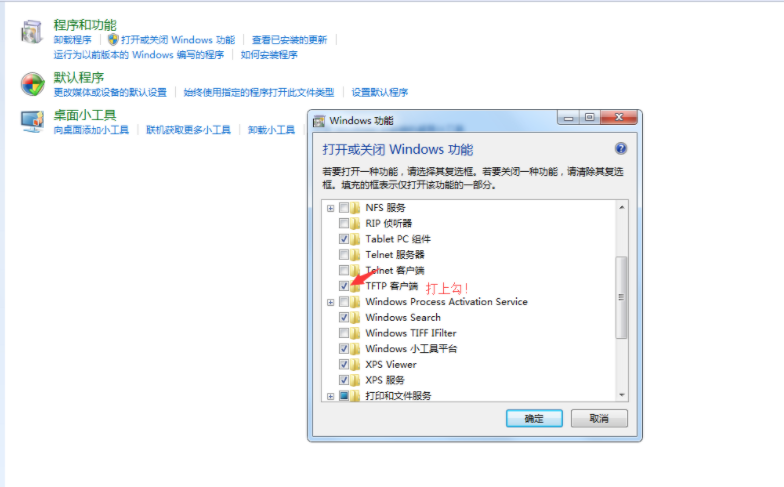

# wndr4300刷op超详细教程,还有安装mentohust

## 刷机教程

准备工作：打开Windows功能中的tftp功能。

首先，电脑打开cmd 输入`ping 192.168.1.1 -t`

1. 电脑改为固定IP（*`192.168.1.2/255.255.255.0`*）
2. 把电脑拉出来的线接到路由lan1，（*路由器的剩下的lan口的网线最好都拔掉*）
3. 断电，就是按掉路由器的那个电源开关
4. 用尖针按住路由后面的复位键，千万不要松手
5. 通电。**等待电源灯 从 黄灯→变为绿灯，并且绿灯一直在闪烁**。然后松开复位键。
6. 打开powershell 输入`tftp -i 192.168.1.1 PUT img_name.img`
7. 等待3到5分钟。
8. 注意看cmd中界面192.168.1.1-t 是否一直能ping通。 持续10秒以上
9. 最后一步很重要，断电（不然的话会没有5G信号，某位大神说的）。步骤如下：
   1. 直接拔掉电源插座，等待5秒左右。（先拔掉电源插座，然后关掉路由器上的开关）
   2. 插上电源插座，等待5秒左右。打开路由器上的开关。

刷机完毕了。把猫的线插到wan口。

web网页在进入192.168.1.1，默认 账号：root 默认密码：无。需要自己设置。

电脑改为自动获取ip。

## 安装mentohust&luci_app_mentohust

mentohust 是锐捷认证的核心部分

luci_app_mentohust是luci的页面配置

